# Gerenciando estados com Provider

Este projeto é fruto do curso de 'Flutter : gerenciamento de estados com Provider' da plataforma ALURA

## Introdução

Dado o aplicativo 'clients_control' onde é carregado diretamente por listas dentro dos widgets 'ClientsPage' e 'ClientTypesPage' a ideia e apresentar o uso de "Provider"
como meio de integração da informação na arvore de widgets.

Abaixo segue a interface da aplicação

<table style="width: 100%; border-collapse: collapse;" border="0">
  <tr>
    <td style="border: none; width: 10%;"> 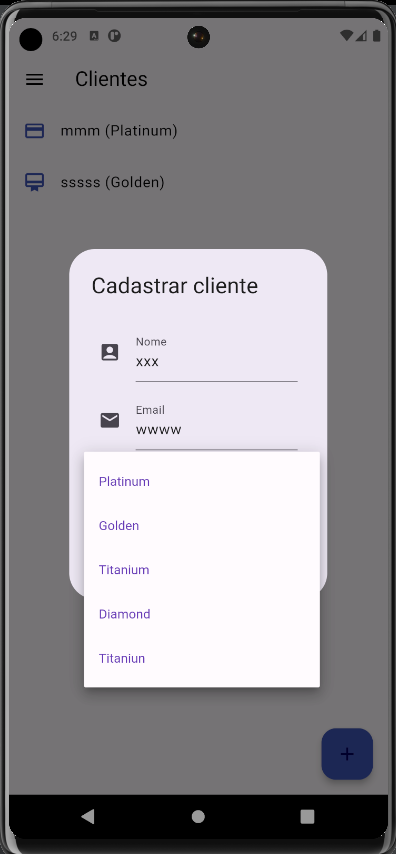</td>
    <td style="border: none; width: 10%;"> 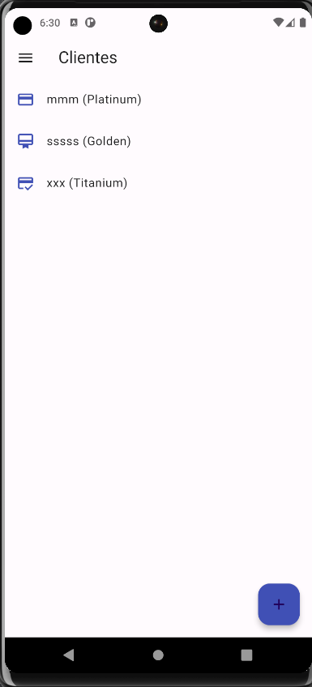</td>
    <td style="border: none; width: 10%;"> 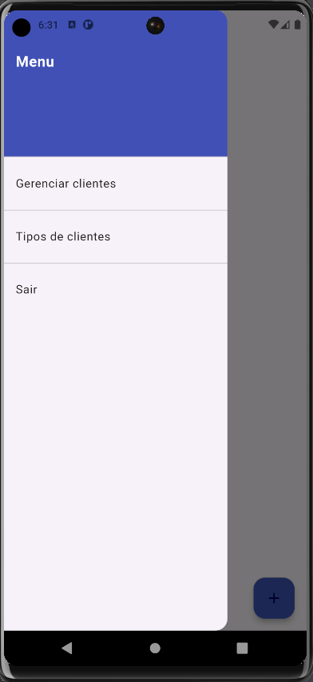</td>
    <td style="border: none; width: 10%;"> 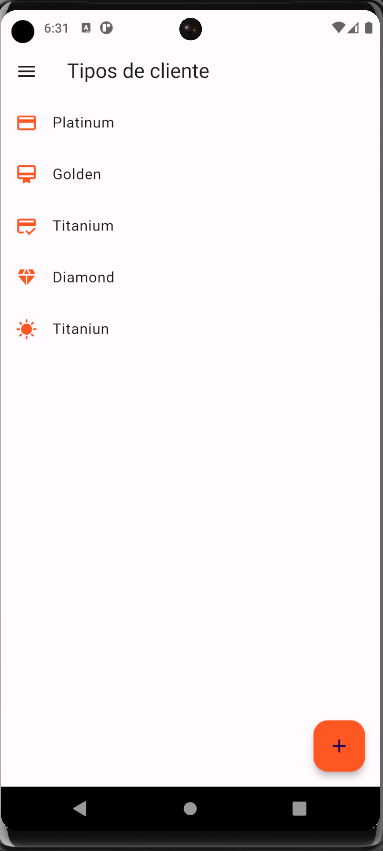</td>
    <td style="border: none; width: 10%;"> 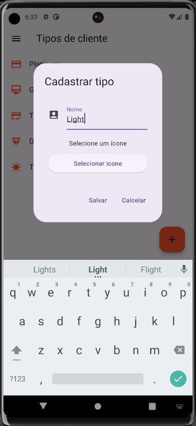</td>
    <td style="border: none; width: 10%;"> 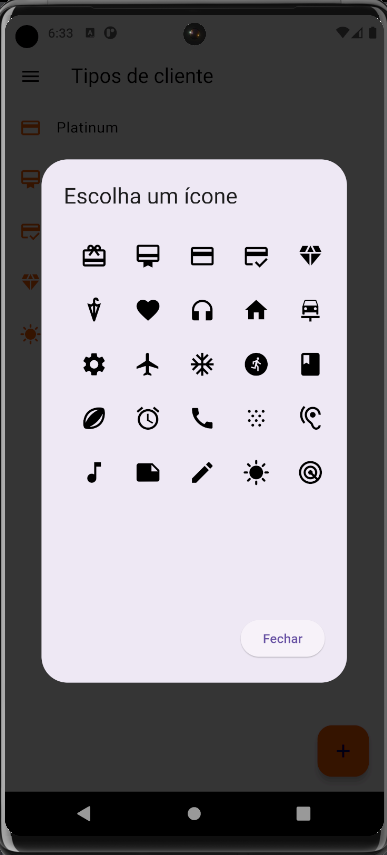</td>
    <td style="border: none; width: 10%;"> 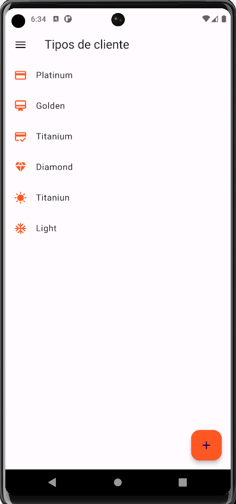</td>
  </tr>
</table>

- Listas fixas nos widgets

   - ClientsPage

 
    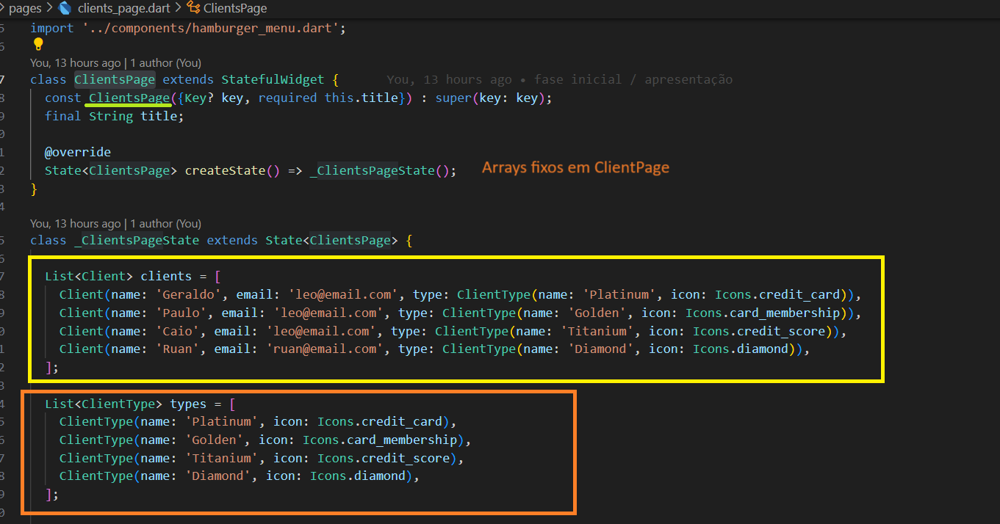

     
   - ClientTypesPage
 
     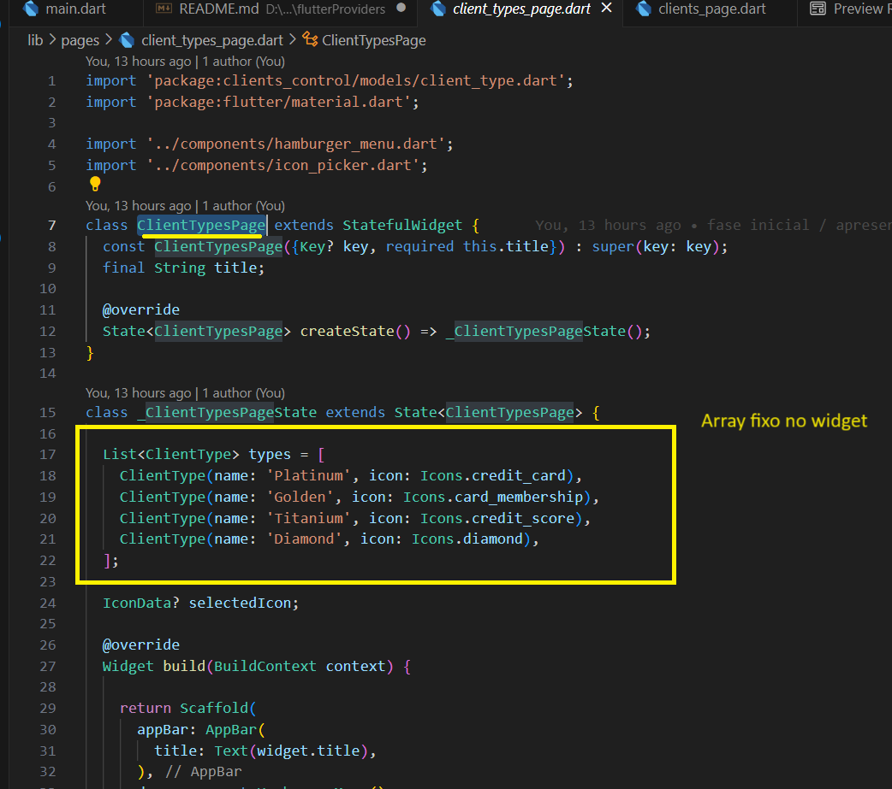

 ## Integração com a single source of true (ssot)

   Adaptação "main()" onde é passado um item de array simulando uma futura carga, na pagina de "ClientsPage()" é feita a remoção do array "clients" assim como adaptada a utilização do provider na apresentação e no botão de adição do "alert dialog". 

   - Alteração na "Main()"

   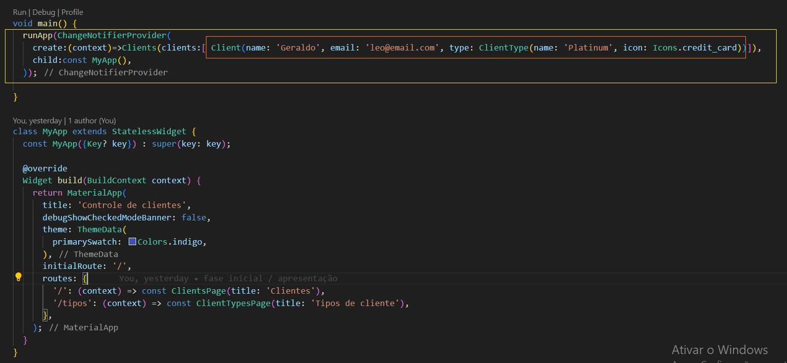

   - Alteração em "ClientsPage()"

     listview.builder

   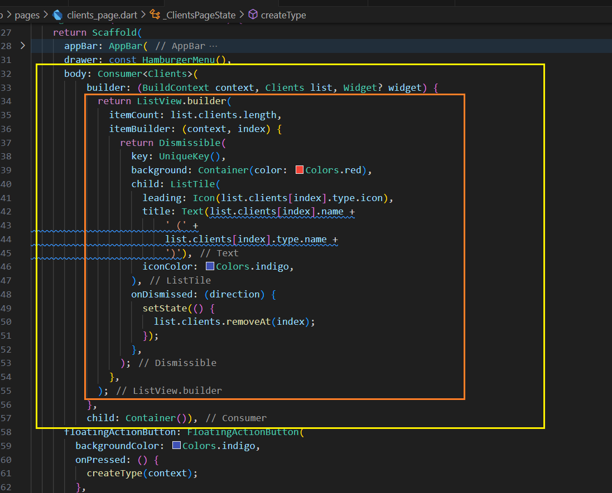

    alertDialog

   

 ##  Aplicando boas práticas  

   Se trata ótima prática atribuir a responsabilidade de adicionar, modificar, excluir os dados de uma model para a model, não pelo aplicativo do pois foi só uma forma didática, em vez de chamar o add do lista criar um método para isso na propria classe Clients.

   
   ClientsPage / add

   

   Clients / add

   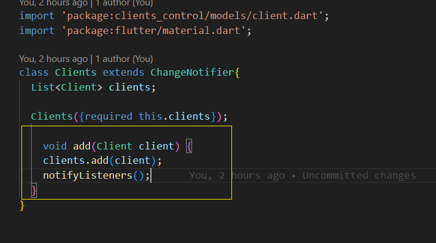

