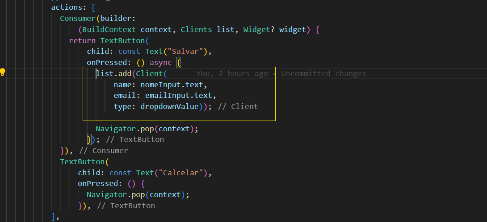
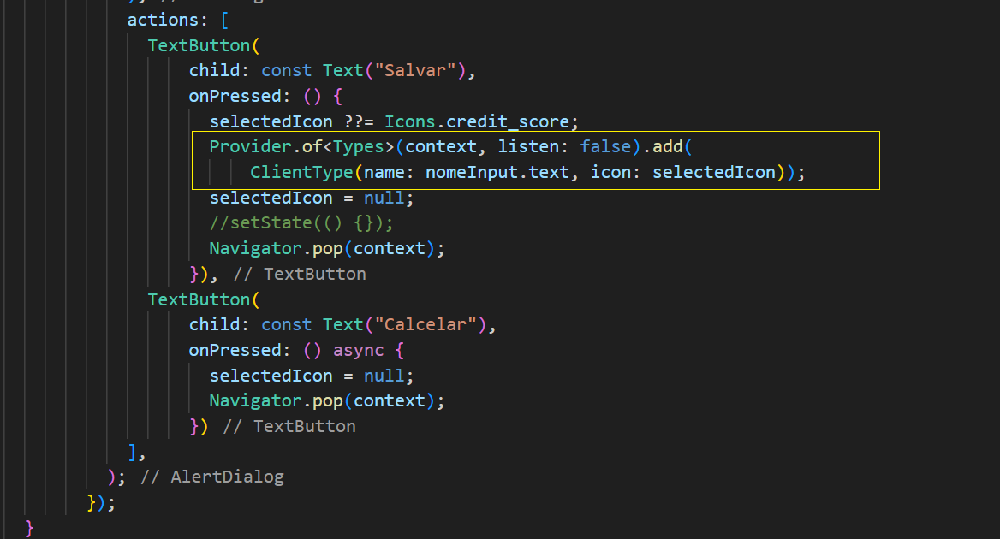

# Gerenciando estados com Provider

Este projeto é fruto do curso de 'Flutter : gerenciamento de estados com Provider' da plataforma ALURA

## Introdução

Dado o aplicativo 'clients_control' onde é carregado diretamente por listas dentro dos widgets 'ClientsPage' e 'ClientTypesPage' a ideia e apresentar o uso de "Provider"
como meio de integração da informação na arvore de widgets.

Abaixo segue a interface da aplicação

<table style="width: 100%; border-collapse: collapse;" border="0">
  <tr>
    <td style="border: none; width: 10%;"> </td>
    <td style="border: none; width: 10%;"> </td>
    <td style="border: none; width: 10%;"> </td>
    <td style="border: none; width: 10%;"> </td>
    <td style="border: none; width: 10%;"> </td>
    <td style="border: none; width: 10%;"> </td>
    <td style="border: none; width: 10%;"> </td>
  </tr>
</table>

- Listas fixas nos widgets

   - ClientsPage

 
    

     
   - ClientTypesPage
 
     

 ## Integração com a single source of true (ssot)

   Adaptação "main()" onde é passado um item de array simulando uma futura carga, na pagina de "ClientsPage()" é feita a remoção do array "clients" assim como adaptada a utilização do provider na apresentação assin como no botão de adição do "alert dialog". 

   - Alteração na "Main()"

   

   - Alteração em "ClientsPage()"

     listview.builder

   

    alertDialog

   

 ##  Aplicando boas práticas  

   Se trata ótima prática atribuir a responsabilidade de adicionar, modificar, excluir os dados de um array para a classe model provider, não pelo array pois o controle sobre os dados sempre é necessário .

   
   ClientsPage / add

   

   Clients / add

   

## Aplicando provider em ClientTypePage

Criação de Types()

Adaptação em Main() da utilização de Multiprovider passando como parametro o array de ClientType para a classe Type que sera o provider desta classe

Adaptação de ListView.builder em ClientTypesPage com o widget Consumer  

Tambem em ClientTypesPage, no widget interno createType, showDialog mais especificamente em actions, TextButton,'salvar', substituição de 'types.add' por ' Provider.of<Types>(context, listen: false).add()' e desativação do setState() já que a classe Types já trata esse ponto.

Inclusão do metodo remove() em CLients() e Types()

  Alteração do codigo no widget Dismissible, na propriedade 'onDismissed' removendo o 'setState()' e adaptando o remove para sendo das classes providers 

## Outros padrões de providers sugeridos

- BloC

- Redux

## Outras bibliotecas sugeridas

- GetX

- MobX

